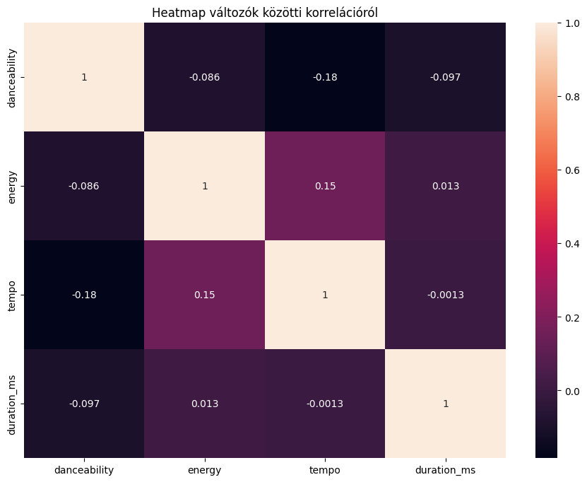
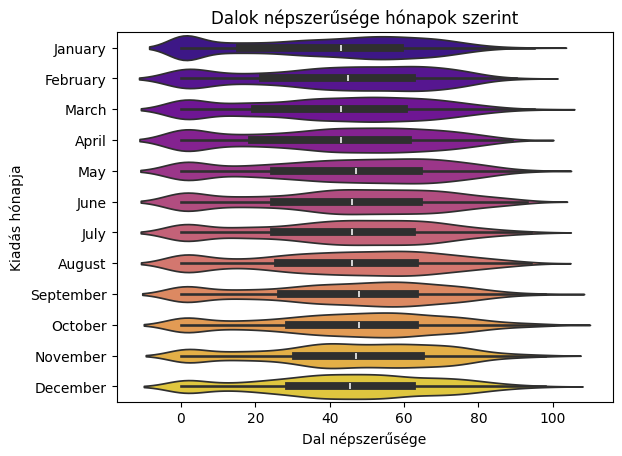
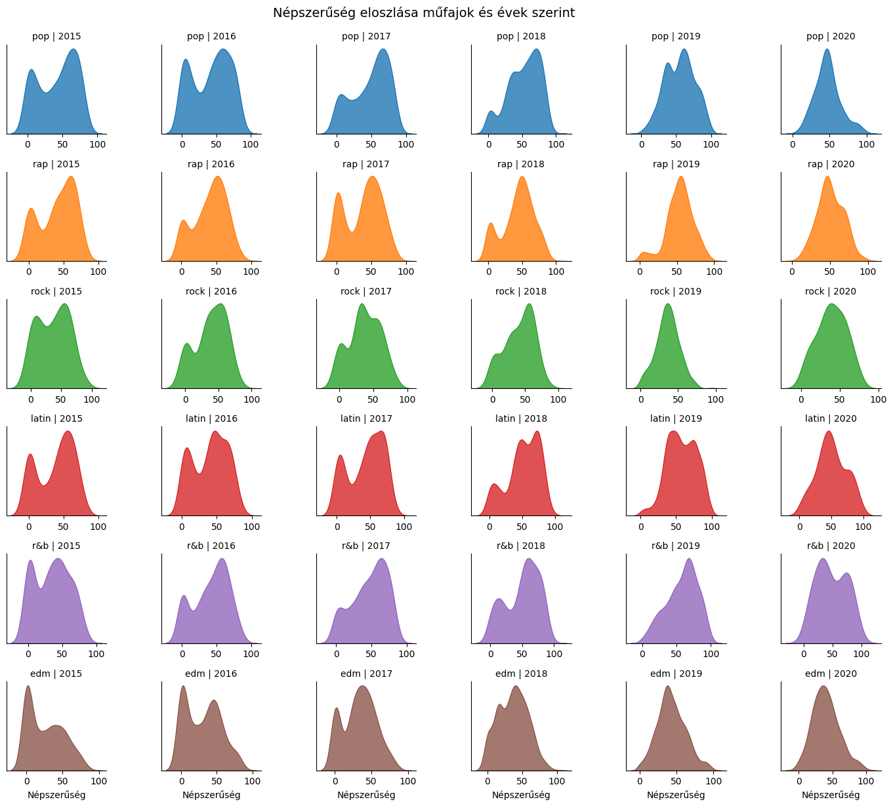
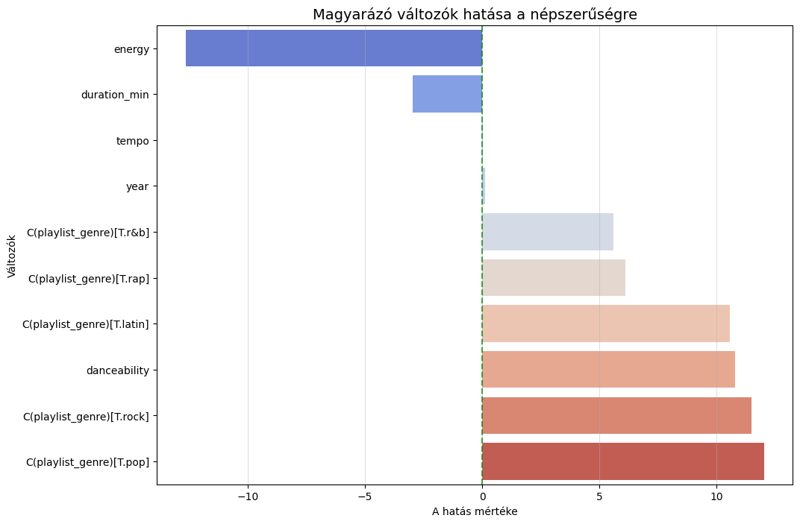
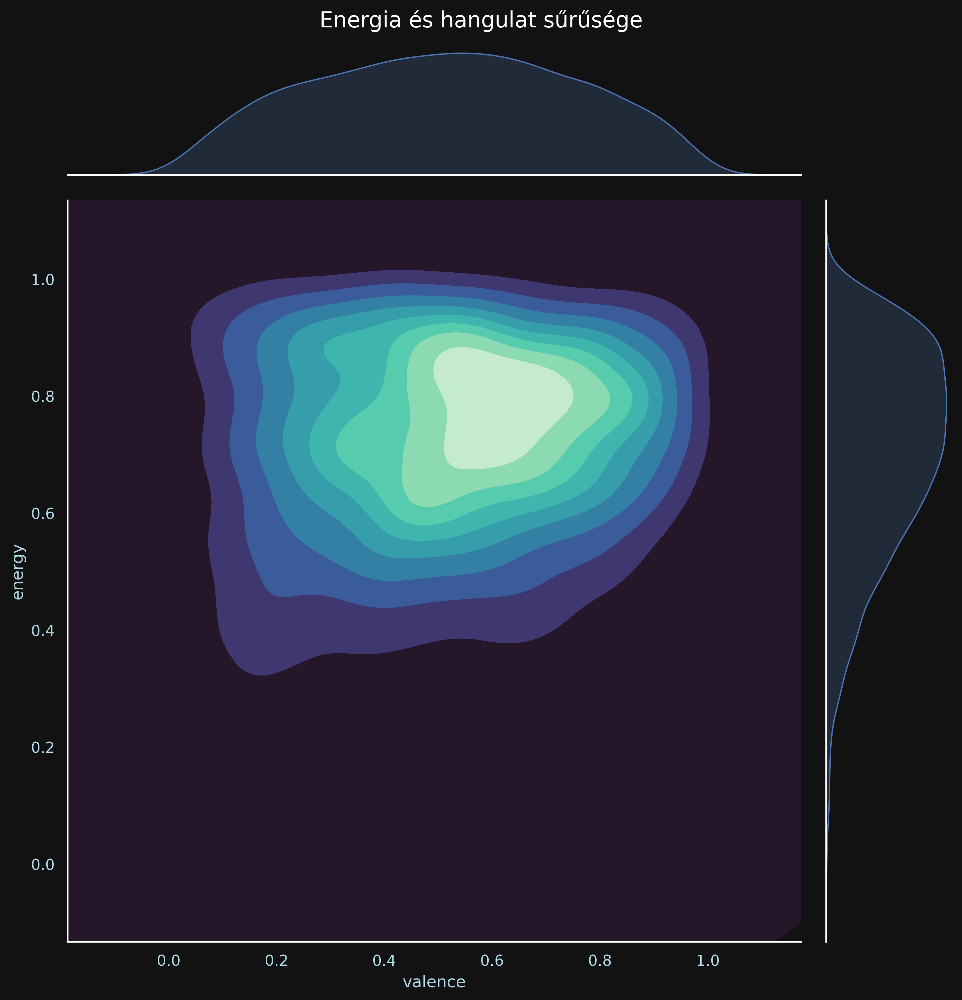
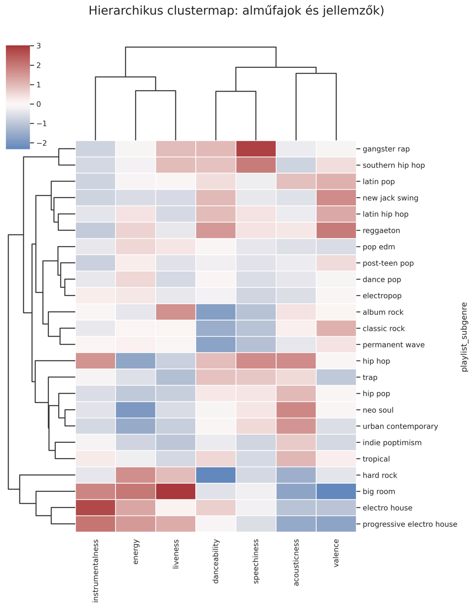
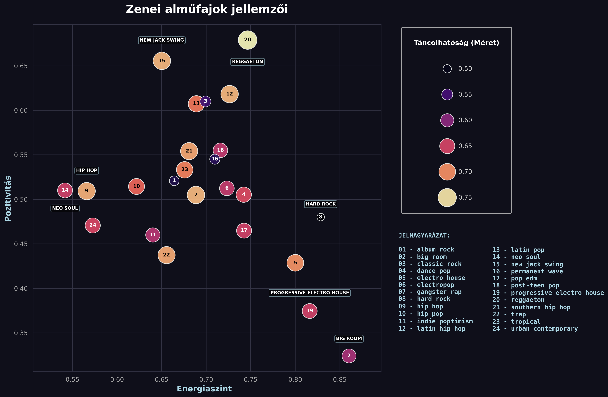
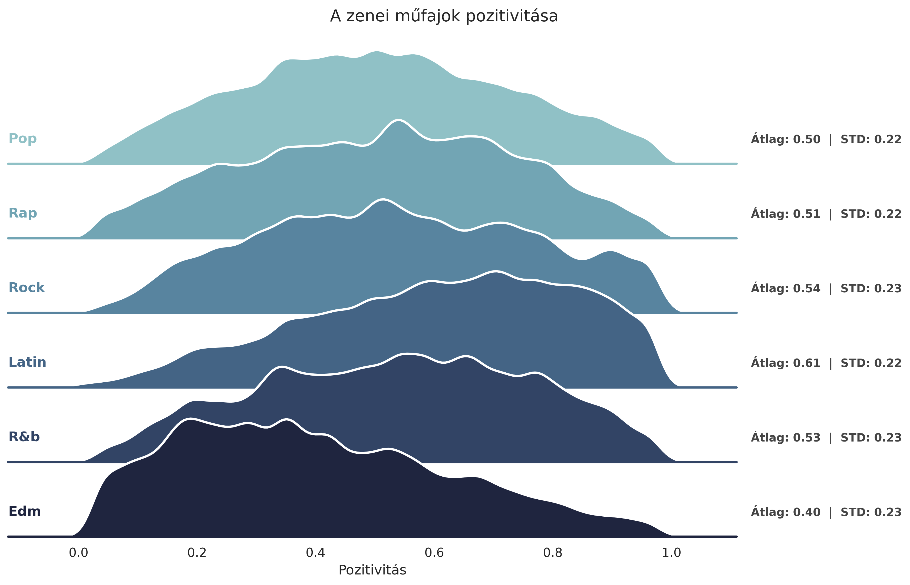

# Spotify Dalok Adatelemzése és Vizualizációja

## A projektet készítették 

- Baranyai Ádám
- Tölgyesi Levente
- Varga András

## A projekt témája

A Spotify ma már legtöbbünk életében kulcsfontosságú szerepet játszik. Sokan (köztük mi is) rendszeres használói vagyunk ennek a platformnak, mivel könnyen használható és majdnem minden népszerű dal elérhető rajta. Kíváncsiak voltunk, hogy vajon mi az, amitől igazán népszerű lesz egy dal, van-e esetleg egy "titkos recept" egy slágerlistás dal létrehozásához.

Projektünk több mint 30 000 Spotify dal adatainak adatvizualizációs elemzésével foglalkozik. Azt vizsgáltuk, hogy milyen tényezők befolyásolják a dalok népszerűségét, és hogy az egyes zenei attribútumok között milyen összefüggés van.

## Adataink

Adataink forrása: Kaggle(Google) 

Link az adatokhoz: https://www.kaggle.com/datasets/joebeachcapital/30000-spotify-songs

Az adatbázist excel és csv formátumban is beolvassuk a kódban, személyes preferencia alapján.

## Használati útmutatás a projekthez
A projektet Pythonban, Jupyter Notebook környezetben készítettük. 

A kód futtatásához először töltsük le a "spotify_songs.csv", a "spotify_zene.xlsx" és a "Vizualizáció_Spotify.ipynb" fájlokat és tegyük őket egy mappába.

Az elemzési és az adatvizualizációs kódot a "Vizualizáció_Spotify.ipynb" fájl tartalmazza.

Ezek azok a meghívott könyvtárak, melyek szükségesek lesznek a kód futtatásához:

- pandas
- numpy
- matplotlib
- seaborn
- statsmodels
- openpyxl
- collections

## KNN algoritmus
  
  Elsőként implementáltunk egy saját KNN algoritmust, amivel egy adott dal műfaját
  szerettük volna kitalálni. Az algoritmusunk az adatok 80%-án tanult és a maradék
  20%-on teszteltük. A felosztás rögzített (seed=42), hogy
  az eredmények reprodukálhatóak legyenek.
  
  A módszer lényege, hogy bizonyos sztenderdizált változók alapján (nekünk
  ezek a danceability, energy, tempo, duration_ms, mode, loudness, valence és
  speechiness voltak) euklideszi távolságot számolunk az ismeretlen műfajú dal és a
  tanítóhalmaz összes dala között. A standardizáláshoz szükséges átlagokat
  és szórásokat kizárólag a tanítóadatokon számoltuk, majd ezeket a paramétereket
  alkalmaztuk a tesztadatokra is. Az algoritmus a k
  legközelebbi szomszédot vizsgálja, és azt a műfajt tippeli, ami ezek között a
  leggyakrabban fordult elő. Ha holtverseny alakul ki, akkor pedig azt, amelyikkel
  először találkozott a tanuló adatbázisban.

  A legjobb k meghatározásához 400 véletlenszerűen kiválasztott tesztponton több k
  értéket is kipróbáltunk (1-től 500-ig), és a pontosságot k függvényében ábrázoltuk. 

## A modellünk változói

A modellünkben használt magyarázó- és eredményváltozóink az alábbiak:

- **track_popularity:** 0 és 100 közötti változó, mely az adott zene népszerűségét méri (100 a legnépszerűbb) - **ez lesz az eredményváltozónk**

- **track_album_release_date:** a zene kiadásának dátuma

- **playlist_genre:** a zene műfaja

- **danceability:** 0 és 1 közötti változó, ami a zene ritmusa és stabilitása alapján méri azt, hogy mennyire jó rá táncolni (1 a legjobb)

- **energy:** 0 és 1 közötti változó, mely azt méri, hogy mennyire energikus (azaz hangos, pörgős) az adott zene (1 a leginkább energikus)

- **mode:** egy dummy változó, mely azt mutatja, hogy az adott szám dúr (vidámabb) vagy moll (borongósabb) hangnemben íródott - a dúr az 1, a moll a 0

- **tempo:** a zene tempója BPM-ben (Beats per minute = percenkénti leütésszám) mérve

- **duration_ms:** a szám hossza milliszekundumokban mérve

## Az elemzésünk

**A cél:** Regressziós modellt szeretnénk építeni, mely egy zene népszerűségét magyarázza a többi változó segítségével.

**Korrelációk elemzése, multikollinearitás keresése:**

Vannak magyarázó változóink, melynek elsőre hasonlónak tűnhetnek (danceability, energy, tempo, duration), így az volt a sejtésünk, hogy lehet köztük nagyobb mértékű korreláció (0,4 feletti), ami multikollinearitást okozhatna a modellünkben. Készítettünk egy heatmap-et, ami az ezen változók között korrelációkat mutatja. A korrelációk kiszámítását saját függvénnyel végeztük.

 

 

A korrelációk gyengék, tehát nem lesz nagy multikollinearitásunk a regresszióban.
Nem meglepő eredmény, hogy minél energikusabb egy zene, annál tempósabb.
Az viszont már jóval érdekesebb, hogy az adatok szerint minél tempósabb egy zene, annál kevésbé táncolható: lehetséges, hogy a nagyon gyors rap és metal számok itt egy kicsi torzítást okoznak, hiszen azokra nem olyan jó táncolni.
Mivel a korrelációk alacsonyak, nem érdemes dimenziót csökkenteni, nem fogunk főkomponenseket készíteni.

 

**Szezonalitás vizsgálata:**

Kíváncsiak voltunk, hogy vajon a kiadás hónapja mennyire befolyásolja egy zene népszerűségét, így létrehoztunk egy "month" magyarázó változót. 
A kérdés elemzésére hegedűdiagramot készítettünk, mely olyan, mint egy hagyományos boxplot (tehát leolvasható róla az adatok mediánja, első/harmadik kvartilise), viszont a hegedű szélessége azt is megmutatja nekünk, hogy az adott értékekhez mennyi adat tartozott. Tehát ha például egy hegedű a 20-as értéknél széles, az azt jelenti, hogy sok dal van, aminek ennyi a népszerűségi indexe.

 

 

Látható, hogy a kiadás hónapja nem befolyásolja erősen a népszerűséget, nincs erős szezonalitás.
Bár a hegedűkön látható, hogy hasonló sűrűséggel vannak dalok az egyes hónapokból, van egy érdekes eredmény: januárban még több népszerűtlen dal van, majd az év vége felé haladva ezek száma elkezd csökkenni és elkezdenek a középmezőnybe kerülni.
Az év vége felé kiadott dalok stabilabb teljesítményt hoznak.
Minden hónapban születnek nagyon sikeres dalok is, nincs egy "arany" hónap.

 

**A trend és a műfajok vizsgálata:**

Mindenképpen érdekes lehet ábrázolni azt, hogy az idő előrehaladtával hogyan változott a dalok népszerűségének eloszlása. Érdemes lehet azonban műfaj szerint is differenciálni őket, mert így a műfaj népszerűségéről is érdekes következtetéseket vonhatunk le. Ezt az aspektust 2015 és 2020 között vizsgáltuk, és Ridge Plot-tal ábrázoltuk:

 

 

Minden műfaj esetében az évek előrehaladtával elkezdtek eltűnni a nulla közeli értékek: ez azt mutathatja, hogy a Spotify algoritmusa egyre hatékonyabban találja meg mindenkinek a neki illő számokat.
A rap műfajban 2015-ben még voltak nem olyan népszerű és nagyon népszerű számok is bőven, 2020-ra azonban a műfaj stabilizálódott, hasonló népszerűségű a legtöbb dal.
Minden műfaj népszerűbbé vált az adatok alapján (ennek alapja a jó algoritmus), viszont a latin és az R&b stílusok különösen nagy sikernek örvendtek 2019 és 2020 körül.

 

**OLS regresszió készítése:**

Az eddig levont következtetések alapján nekikezdtünk a regressziós modellünk felépítéséhez.

A hegedűdiagramunk azt mutatta, hogy az adatokban nincs nagy mértékű szezonalitás, így ezt nem szerepeltetjük a modellben.
A ridge plotunk alapján az évnek (trend) és a műfajnak jelentős hatása lehet, így ezeket beletettük a modellbe.
A 4 elsőre hasonlónak hitt változó között (táncolhatóság, energiaszint, tempó, hossz) nem volt nagy korreláció, így ők is mind szerepelnek a modellben.
Külön érdekességként beletettük a hangnemet is (dúr vagy moll), mert ezzel is érdekes összefüggéseket kaphatunk.

 

## A regresszió eredményei ##

**A modell értékelése:** Az R^2 értéke 0,063, azaz a modellünk a zenék népszerűségének 6,3%-át tudta megmagyarázni. 
Bár ez alacsonynak tűnhet, egy olyan kiszámíthatatlan piacon, mint a zeneipar ez egész jó érték, hiszen itt a személyes preferenciák, a szerencse, a marketing és a közösségi média trendek is nagy szerepet játszanak, amiket nem tudtunk mérni.

**Hangnem:** Az egyetlen változó ami a p-érték szerint nem szignifikáns, az a hangnem. Ez azt mutatja, hogy egy zene népszerűsége nem függ az adataink alapján szignifikánsan attól, hogy dúr vagy moll hangnemben íródott.

**Műfaj:** A műfajok valóban nagyon sokat számítanak: a referenciaváltozónk az EDM volt, ehhez képest a népszerűségi lista az alábbiak szerint alakul:
1. pop - az, hogy egy szám popszám és nem EDM szám, ceteris paribus 12,03 ponttal növeli a népszerűségét (a többi műfajnál az értelmezés analóg módon történik)
2. rock - 11,49
3. latin - 10,59
4. rap - 6,11
5. r&b - 5,61
6. EDM - referenciaváltozó

**Trend:** Egyértelmű trend is megfigyelhető a népszerűségben: ha egy szám ceteris paribus 1 évvel később jelent meg, akkor várhatóan kb. 0,13 ponttal lesz nagyobb a népszerűsége.

**Táncolhatóság:** Minél táncolhatóbb egy szám, annál népszerűbb: minden más változatlansága mellett ez nagyon sokkal növeli a népszerűséget. Ha egy közepesen táncolható (0,5 értékű) zenét ceteris paribus jól táncolhatóvá (0,8) teszünk, az várhatóan 3,2 ponttal növeli a népszerűségét.

**Energia:** Az energiaszint meglepő módon ellentétes viselkedést mutat: minél energikusabb egy dal, várhatóan annál kevésbé lesz népszerű. Az emberek valószínűleg nem kedvelik a nagyon zajos, kaotikus számokat.

**Tempó:** A tempósabb dalok népszerűbbek lehetnek: egy BPM növekedés ceteris paribus 0,02 ponttal növeli a népszerűséget.

**Hossz:** A hosszra pont ezt az eredményt vártuk: átszámolva 1 perc hosszúságnövekedés minden más változatlansága mellett 3 pontot vonhat le egy szám népszerűségéből.

 

**Barplot a szignifikáns magyarázó változók hatásáról:**

Az alábbiakban egy barploton mutatjuk be a szignifikáns magyarázó változók hatását. Ahhoz, hogy a hossz hatása rendesen kivehető legyen, át kellett konvertálni percre.

 

A negatív hatások kék, a pozitívak pedig piros színnel vannak jelölve.

 

**Összefüggés a zenék energiája és hangulata között:**

A teljes adatbázisból vettünk egy 3000 zenéből álló mintát véletlenszerűen, majd hangulatuk és energiájuk szerint ábrázoltuk őket. Hogy jól látható legyen, hol sűrűsödnek az adatok, egy kétdimenziós sűrűségdiagramot alkalmaztunk. A szintvonalas megjelenítésnek köszönhetően könnyebben olvasható az ábra. A világoszöld területek jelzik azokat a (hangulat, energia) párokat, amelyek a leggyakrabban fordulnak elő, míg a sötétedő, lilába hajló részek a ritkább eseteket jelzik. A megfelelő tengelyekkel párhuzamosan, a grafikon szélén a hangulat és az energia egyéni eloszlása is megjelenik.
 

 
Alapvetően ritkák a kis energiával rendelkező dalok, ezt magyarázhatja, hogy az emberek ingerküszöbe már magasan van, nem köti le a figyelmet egy kevésbé energikus dal, így kevesebb ilyen dal készül. A leggyakoribb kombinációkban a dal energia szintje magas (0.6 - 0,9), viszont a hangulata szélesebb skálán mozog. Ez visszatükrözi az egyéni eloszlásokat is. 

 

**Hierarchikus clustermap: alműfajok és jellemzők**

Arra voltunk kíváncsiak, hogy az adatbázisban rögzített jelemzők alapján, hogyan lehetne csoportosítani az alműfajokat, mik azok a tuljadonságok, amik erősen összekötnek egy-egy csoportot. A tulajdonságok (pl. táncolhatóság, energia, akusztikusság) alapján egy hierarchikus hőtérképet, clustermap-et készítettünk. Az ábrázolás előtt az értékeket standardizáltuk, így a különböző skálán mozgó változók közvetlenül összehasonlíthatóvá váltak.  Az algoritmus a hasonló zenei profillal rendelkező alműfajokat, illetve a gyakran együtt mozgó jellemzőket egymás mellé rendezi, amit az ábra szélein látható fagráf vizualizál. 
 A színek jelentése: 
 - fehér: átlagos érték
 - piros: a műfajt az adott tulajdonságban erősen átlag feletti értékek jellemzik
 - kék: a műfajt az adott tulajdonságban erősen átlag alatti értékek jellemzik
 
 

 

 Alapvetően az intuitíven hasonlónak gondolt műfajok a fagráfban is közel kerültek egymáshoz. Ami számunkra érdekesebb volt, hogy egymástól távol álló műfajok hangzásvilága egy-egy adott paraméterben meglepően közel állhat egymáshoz (pl.: pop és rock műfajok).

 

 **Alműfajok elhelyezkedése energia, pozitivitás és táncolhatóság szerint:**

Itt a vizualizációt állítottuk középpontba, a statisztikai elemzést háttérbe szorítva. Ezzel az volt a célunk, hogy a számunkra legérdekesebb jellemzőket és azok kapcsolatát be tudjuk mutatni egy jól befogadható ábrán. 

 

 

 **Alműfajok hangulata:**

A különböző zenei műfajok hangulatának összehasonlításához ridge plot-ot készítettünk, baloldalt minden műfajhoz felírtuk az átlag és a szórás értékét.

 

 

## Konklúzió

A több mint 30 000 Spotify dal elemzése után azt tapasztaltuk, hogy bár egy zene sikerességét nehéz előre megjósolni, vagy jó receptet készíteni egy slágerhez (ezt a regressziós modellünk 6,3%-os magyarázó ereje is mutatja), de a népszerűséget egyértelműen befolyásolják bizonyos zenei tulajdonságok.

A regressziós modellünk és az adatvizualizációink alapján az alábbiakat kell figyelembe vennünk, ha egy sikeres zenét akarunk készíteni:
- Műfaj kiválasztása: A műfaj nagyon befolyásolja a népszerűséget, például a pop, a rock és a latin stílusok kiemelkedően népszerűek más műfajokhoz képest.
- Magas táncolhatóság:  Egyértelműen azok a daloknak nagyobb a népszerűsége, amelyek ritmusosak és jól lehet rájuk táncolni.
- Rövid és tempós: A gyorsabb dalok sikeresebbek, ugyanakkor a nagyközönség nem szereti a hosszú zenéket.
- Mértékletes energiaszint: Meglepő eredmény, de a túl energikus dalok kevésbé vonzzák a hallgatókat, így az energiával érdemes óvatosan bánni.

A következő tulajdonságok meglepően nem befolyásolják érdemben egy dal sikerét: 
- Szezonalitás és hangnem: A közhiedelemmel ellentétben nincs kifejezetten előnyösebb hónap a dalok kiadására, pedig például a nyári slágerek miatt feltételezhető lenne, hogy a nyár eleje a legjobb választás. Az sem számít szignifikánsan a népszerűség szempontjából, hogy egy dal dúr vagy moll hangnemben íródott.
